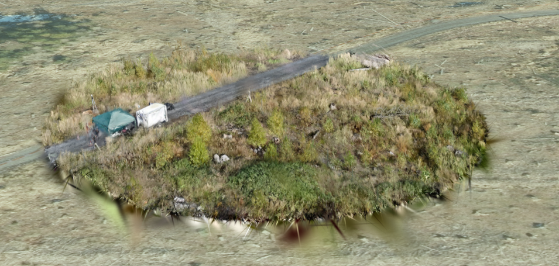

# garrulus-gaussian-splatting

A demo to use gaussian splatting for the garrulus forest databse




## Description

This project is a cesium gaussian splat web viewer that runs inside a Docker container. The container is set up for development mode, allowing you to run the app in a controlled environment, with the ability to make live code changes and have them reflected immediately.

## Prerequisites

Before getting started, ensure you have the following tools installed on your local machine:

- [Docker](https://www.docker.com/get-started) (for running the container)
- [Git](https://git-scm.com/) (for cloning the repository)

## Getting Started

### 1. Download the dockerfile


### 2. Build the Docker Image

Build the Docker image from the `Dockerfile` in the repository:

```bash
docker build -t garrulus-cesium-splat .
```

This will create a Docker image tagged `garrulus-cesium-splat`.

---

### 3. Run the Docker Container

Run the Docker container in **development mode** to start the Vite development server on port 3001:

```bash
docker run -d -p 3001:3001 --name garrulus-cesium-splat-container garrulus-cesium-splat
```

---

### 4. Access the Application

After the container starts, open your browser and go to:

```
http://localhost:3001
```

You should now see your Vite application running in development mode.

---

### 5. Stop the Docker Container

To stop the container, use the following command:

```bash
docker stop garrulus-cesium-splat-container
```

This will stop the running container.

---

### 6. Remove the Docker Container

If you no longer need the container, you can remove it:

```bash
docker rm garrulus-cesium-splat-container
```


## Info

This repo is adapted from Tebben's work [Link](https://github.com/tebben/cesium-gaussian-splatting)

The demo uses one splat created using splatfacto which was cleaned up a bit using [supersplat](https://github.com/playcanvas/supersplat)

To be able to show Three.js scenes within CesiumJS we need to render the Three stuff on top of Cesium and sync the Cesium camera to Three, this is not ideal because things are not aware of eachother and Three scenes can be seen trough the terrain and other objects placed in CesiumJS such as buildings.